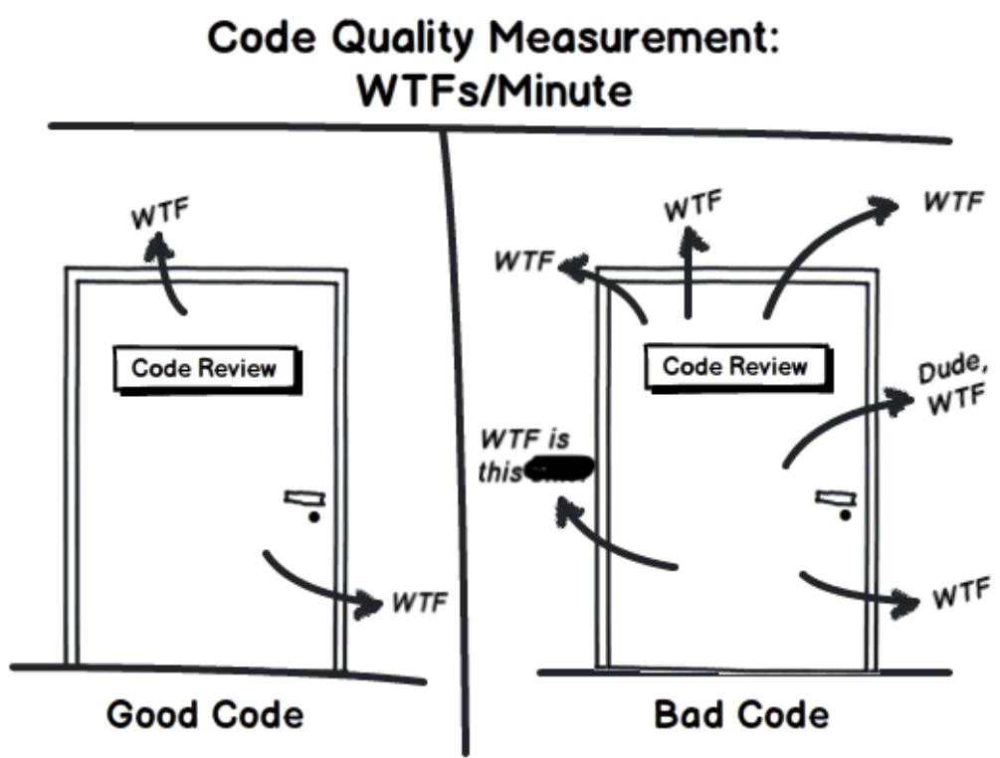

> *"Any fool can write code that a computer can understand. Good programmers write code that humans can understand." – Martin Fowler*
> 

> *“Any fool can write code a computer can understand, and increasingly, so can an AI. Good programmers write code that humans can understand, but the best programmers build bridges between human code, AI-generated code, and the humans who must maintain and improve it all”.*
>

---

---

### What is Clean Code?

- Code that
    - is easy to read
    - is meaningful
    - is concise
    - gets straight “to the point”
    - reduces cognitive load
    - follows best practices and common patterns
    - is fun to write and maintain
- Code that **doesn’t**
    - have unintuitive names
    - have complex nested loops
    - have big code blocks

---

---

