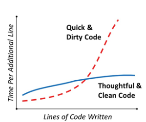

- Clean code is straightforward to read and understand, making it simpler for anyone to work with, including AI models.
- It's easier to fix and update clean code, which saves time and reduces errors.
- AI models learn from existing codebases, and clean code provides a better foundation for training. High-quality, well-structured code helps AI understand best practices and generate better code in the future.
- Clean code ensures that software can grow and adapt to new needs efficiently.

